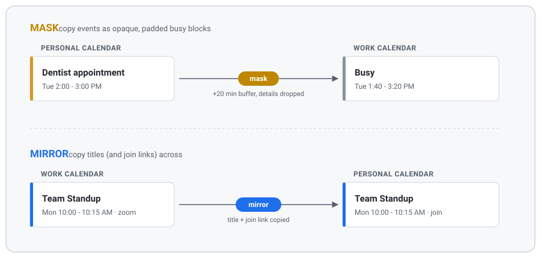

# calsync

One Google Apps Script that keeps two calendars in sync, two ways.



- **mask** - copy events onto another calendar as opaque, padded "busy" blocks.
  Others see you're busy; no details leak.
- **mirror** - copy event titles (and optionally a join link / room) onto another
  calendar, so you can see your schedule without signing into the source account.

Both are the same operation - reconcile a source calendar into a target - so they
share one engine and differ only by config. You declare what you want as rules; the
engine makes the target match, creating/updating/deleting as needed. It's idempotent,
so it's safe to run repeatedly.

It's also self-correcting inside the sync window: if a target ends up with two copies
of the same source event, the next run keeps one and deletes the rest, so duplicates
converge on their own without you doing anything. Copies it can't recognize as its
own, and anything sitting outside the window, need the cleanup sweep below.

## Quick start

**Prerequisites:** Node 20+, and a Google account with the Apps Script API turned on
(one-time, at <https://script.google.com/home/usersettings>). The calendars you want
to sync must be shared into that account - read on sources, write on targets.

```bash
# 1. Clone and install tooling (clasp + types)
git clone https://github.com/fisherevans/calsync.git && cd calsync
npm install

# 2. Create your config from the template and fill in your calendars + rules
cp Config.example.js src/Config.js
$EDITOR src/Config.js

# 3. Log clasp in as the account the script will run as (opens a browser)
npx clasp login

# 4. Create a fresh standalone Apps Script project (writes .clasp.json)
npx clasp create --type standalone --title "calsync" --rootDir src

# 5. clasp create wipes the OAuth scopes from the manifest - restore them,
#    then set "timeZone" in src/appsscript.json to yours
git checkout -- src/appsscript.json

# 6. Push your code and open the editor
npx clasp push
npx clasp open-script
```

Then, **in the Apps Script editor** (the function picker only lists functions from
the open file, so open `Engine.gs` first):

1. Run **`dryRunAll`**. First run shows an OAuth consent screen - it's an unverified
   personal script, so **Advanced -> Go to calsync (unsafe) -> Allow**. Check the
   execution log's `SUMMARY` line: dry run writes nothing, it only reports what it
   *would* change.
2. If that looks right, run **`syncAll`** for real.
3. Run **`setupTriggers`** once to install the hourly sweep + per-calendar update
   triggers.

That's it. Edit `src/Config.js`, `npx clasp push`, re-run `dryRunAll` to confirm, and
your repo is the source of truth.

## Cleanup and diagnosis

Three more functions live in `Engine.gs` and run the same way - open the file, pick
the function, hit **Run**. You won't need them on a fresh setup; they're for when a
target calendar has picked up duplicates the sync window can no longer reach.

1. **`dryRunCleanupStrays`** - reports the duplicate copies on your target calendars
   and writes nothing. It scans 90 days back as well as forward, so it covers the
   events a forward-only sync never revisits. It reports two kinds: extra copies
   carrying the same calsync tag (exact - same tag value means the same source
   event), and untagged copies sitting at the same title, start and end as an event
   calsync owns (inferred - a group with no tagged sibling is left alone, because
   there's no evidence it came from here).
2. **`cleanupStrays`** - deletes exactly what the dry run listed. Read that report
   first; this is the only function here that removes events.
3. **`diagnoseDuplicates`** - read-only, writes nothing. For the worst duplicate
   groups it prints every member's stored tag value alongside the source key the
   engine computes now, which is how you tell copies of one event from an identity
   that drifted between runs.

All three work rule by rule over your rules' target calendars, scanning from 90 days
back to 30 days past the end of each rule's window, and report into the execution log
alongside the `SUMMARY` line `dryRunAll` writes.

## More

- [docs/DEVELOPMENT.md](docs/DEVELOPMENT.md) - how the engine works, repo layout,
  updating config, migrating from an old sync setup, operational limits and gotchas.
- [Config.example.js](Config.example.js) - the full rule field reference, inline.
